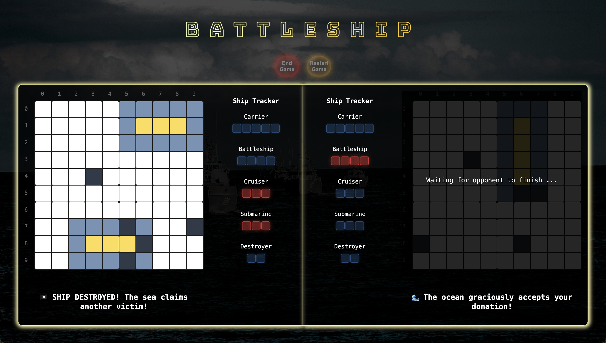

# Battleship App

Implementation of the classic Battleship game with engaging UI features and intelligent gameplay for both human and computer players.

---

## Table of Contents

- [Features](#features)
  - [Game Modes](#game-modes)
  - [Placement Modes](#placement-modes)
  - [Gameplay Mechanics](#gameplay-mechanics)
- [Setup](#setup)

---

## Features

### Game Modes

1. **Human vs Computer (HVC)**

   - Human players face off against an AI opponent with intelligent move generation.
   - Human player provides attack coordinates by clicking the grid.

2. **Human vs Human (HVH)**
   - Two human players play on the same device with a "pass device" feature for fair gameplay.
   - Players take turns providing attack coordinates by clicking the grid.

### Placement Modes

1. **Human Player:**

   - Drag-and-drop ships onto the board.
   - Generate random ship placement with a button.

2. **Computer Player:**

   - Automatically generates its own ship placements (drag-and-drop not applicable).

3. **Human vs Computer:**

   - Human player places ships while the computer's board is hidden.

4. **Human vs Human:**
   - Pass device feature ensures fair ship placement:
     - Human player 1 places their ships.
     - After clicking "Continue," human player 2 places their ships.
     - Boards are hidden and revealed appropriately.

### Gameplay Mechanics

- **Turn Management:**

  - Turns are visually enforced using a dark translucent overlay on the inactive player's board.

- **Computer AI:**

  - Random attacks in a checkerboard pattern for higher probability of hits.
  - Once a hit is made, a tree algorithm targets adjacent slots in the direction of the ship's orientation until it is sunk.

- **Sinking Ships:**

  - Each player's gameboard is accompanied by a ship dock UI.
  - Sunk ships glow red in the dock to provide a real-time visual of game progress.

- **Game End:**
  - Players can choose to rematch or end the game.



## Setup

1. Clone the repository:
   ```bash
   git clone https://github.com/your-username/battlelship-app.git
   cd battlelship-app
   ```
